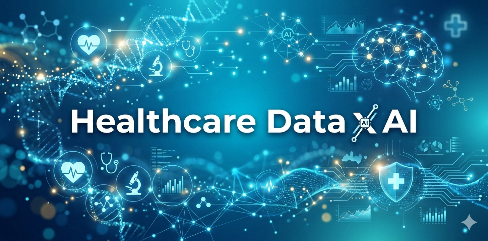

*Bridging clinical expertise with data & AI to build better healthcare*

---
# Healthcare Analytics Engineer Handbook

**Your essential guide to healthcare analytics: bridging clinical knowledge and data skills for transforming patient care.**

## About This Handbook

Hi, I'm **Chad You (尤哥)** — "Shovel Seller MD". 

With over 10 years of hands-on experience shipping **medical AI** in US hospitals and currently serving as Senior Product Manager at Vanderbilt University Medical Center (VUMC) Health Policy, where I lead the Clinical Research Data Core, I've seen firsthand how powerful the intersection of clinical domain expertise and modern data/AI skills can be.

This handbook is the resource I wish I had when I started my journey in healthcare analytics and AI. It draws inspiration from resources like Zack Wilson's *Data Engineer Handbook* and the *Data Roles Continuum*, recognizing that many healthcare professionals (regardless of title — analyst, scientist, or engineer) are effectively **analytics engineers** in practice.

The goal: Equip you with the **business knowledge**, **hard technical skills**, and **soft skills** needed to turn raw healthcare data into real impact — from clinical quality improvement to population health management and value-based care.

I'm now focusing more on **"selling shovels"** for the 2025-2026 medical LLM gold rush through actionable playbooks, code, and frameworks (check my Substack for weekly insights). This handbook remains a community resource and is open to contributions.

## Who Is This For?

- Clinicians transitioning into data/AI roles
- Data professionals entering healthcare (analysts, engineers, scientists)
- Product managers and leaders in health tech/hospitals
- Anyone wanting to bridge clinical context with technical execution

## Structure

### Section I: Business Knowledge (`healthcare-knowledge.md`)
- **Chapter 1: Healthcare System Fundamentals**
  - Ecosystem overview, key stakeholders (providers, payers, patients, regulators)
  - Healthcare business models and revenue cycle management
- **Chapter 2: Healthcare Data Landscape**
  - Types of healthcare data
  - **Data standards and conversions** — HL7, FHIR, SNOMED CT, ICD, CPT, and interoperability
  - Data governance, HIPAA, and privacy considerations
- **Chapter 3: Healthcare Analytics Use Cases**
  - Clinical quality improvement, population health, financial optimization, operational efficiency
  - Value-based care, provider lookup, and real-world case studies

### Section II: Hard Skills (`hard-skills.md`)
- **Chapter 4: Healthcare Data Architecture**
  - Data warehousing, data lakes, EHR integration strategies
- Upcoming: Data modeling, SQL for healthcare, visualization, advanced analytics/ML

### Section III: Soft Skills (`soft-skills.md`)
- Collaboration with stakeholders, project management, translating business questions into analytics, ethical considerations

(Chapters 5–12 are planned and will be expanded based on community input.)

### Appendices
Curated resources including:
- Books (e.g., *Healthcare Analytics Made Simple*, AI in healthcare titles)
- Courses, blogs, newsletters, journals
- Open datasets (CMS, CDC, etc.)
- Recommended repos, projects (like Tuva), tools, and social accounts

## Key Themes: Data Conversions & Interoperability

A core focus is **converting** messy, siloed clinical data (from EHRs and other sources) into standardized, analytics-ready formats. This includes:
- Mapping between proprietary systems and standards like **FHIR**
- ETL processes for claims, clinical, and operational data
- Ensuring compliance while enabling insights

## How to Use This Repo

1. Start with the [Table of Contents](#structure) and `healthcare-knowledge.md`
2. Dive into practical chapters based on your needs
3. Explore the appendices for deeper learning and tools
4. Star the repo if you find it useful, and consider contributing!

## Contributing

This is a living, community-driven project (88+ commits and growing). Contributions are welcome — whether it's:
- Expanding chapters
- Adding case studies or code examples
- Fixing typos or improving explanations
- Suggesting new resources

Open an issue or submit a PR. Let's build better healthcare analytics together.

## Connect With Me

- **Website**: [chadyou.com](https://www.chadyou.com/)
- **X (Twitter)**: [@youcc](https://x.com/youcc)
- **Substack** (Shovel Seller MD — medical LLM playbooks): [chadyou.substack.com](https://chadyou.substack.com/)
- **LinkedIn**: Search "Chad You" or check my profile
- Other repos: Maps/visualization experiments, etc.

I'm based in Tennessee, USA, and practice Aikido when not wrangling healthcare data.

## License

MIT License — feel free to use, adapt, and build upon this work.

---

**"Selling shovels" for the medical AI and analytics gold rush since 2025.**

Made with ❤️ for the healthcare data community.

